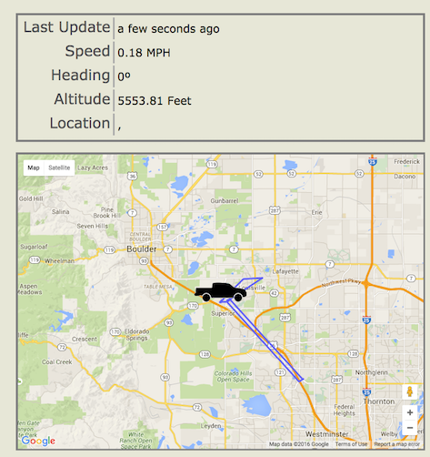

# car-monitor

I built a vehicle tracker using an [esp8266 microcontroller](http://www.esp8266.com/), a [GPS module](http://arduinostuff.blogspot.com/2014/05/neo6mv2-gps-module-with-arduino-uno-how.html), and a [sim900 cellular module](http://www.geeetech.com/wiki/index.php/Arduino_GPRS_Shield)

The UI is mongo, angular 1.5, express, node
